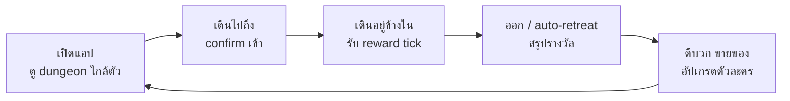
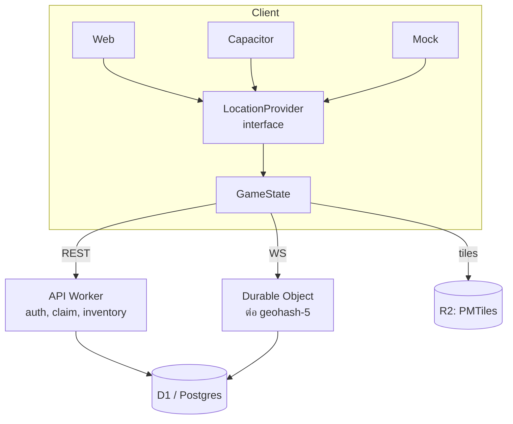

# เกม GPS Dungeon กรุงเทพฯ — Design Document

Sep 23, 2026 · @Pongpon

## ภาพรวมและหลักการออกแบบ

เกม location-based แบบ co-op ล้วน ไม่มี PvP ผู้เล่นออกไปเดินในพื้นที่สาธารณะจริงในกรุงเทพฯ และปริมณฑล เข้าสู่ dungeon ที่เป็นสวนสาธารณะ ตลาด หรือสถานที่ท่องเที่ยว เพื่อสะสมของและอัปเกรดตัวละคร เป้าหมายของเกมคือทำให้คนออกไปเดิน ทุกกลไกต้องตอบโจทย์นี้

**Core fantasy** — เมืองมีรอยแยกที่ปะทุตามสถานที่ที่มีคนพลุกพล่าน ผู้เล่นคือหน่วยที่ออกไปเคลียร์

**Core loop**



### หลักการที่ใช้ตัดสินทุกข้อขัดแย้ง

1. **ไม่จำกัดสิ่งที่ผู้เล่นได้ จำกัดเฉพาะสิ่งที่ไหลเข้าเศรษฐกิจส่วนกลาง** — ไม่มี PvP คนขยันจึงสมควรแข็งแกร่งกว่าโดยไม่มีเพดาน แต่ปริมาณ gold ที่ไหลเข้าตลาดต้องคุมเพื่อไม่ให้ราคากระทบคนที่มีเวลาน้อย
2. **รางวัลผูกกับการเคลื่อนไหวจริงเสมอ** — ทุกระบบที่ให้ของต้องผ่าน movement gate เดียวกัน ไม่มีข้อยกเว้น
3. **ต้นทุนการเดินทางสูง บทลงโทษจึงต้องต่ำ** — ผู้เล่นเดินทางจริงเพื่อมาเล่น ระบบต้องไม่ทำให้เขามาถึงแล้วเล่นไม่ได้
4. **คนเก่งเป็นประโยชน์กับคนอื่น** — buff ของ party ทำให้ผู้เล่นเลเวลสูงเพิ่มคุณค่าให้ทุกคนรอบตัว ไม่ใช่แย่งทรัพยากร
5. **ไม่บังคับให้คนแปลกหน้าเจอกัน** — อยู่ในกรอบสถานที่เดียวกันถือว่าเล่นด้วยกันแล้ว

### ข้อจำกัดที่กำหนดรูปร่างของ design

| ข้อจำกัด | ผลต่อ design |
| --- | --- |
| Web ไม่มี background location | เล่นเป็น session ที่ผู้เล่นตั้งใจเปิด ไม่ใช่ ambient tracking |
| GPS ในอาคารไม่แม่น | dungeon เป็นพื้นที่กลางแจ้งทั้งหมดใน v1 |
| กรุงเทพร้อนและฝนตก 6 เดือน | ต้องมีกิจกรรมที่ทำที่บ้านได้ (ตีบวก ตลาด) |
| GPS spoof ง่ายมาก | validate ฝั่ง server ทั้งหมด ไม่เชื่อ client เลย |

## World building

ยังไม่ตัดสินใจขั้นสุดท้าย ส่วนนี้เป็นข้อเสนอที่รอการยืนยัน

### ธีมและการตั้งชื่อ

ใช้ urban fantasy ที่ตั้งอยู่ในกรุงเทพจริง โทนตลกแห้ง — รอยแยกมิติ ปีศาจ ผู้กล้า แต่เล่าผ่านรถติด คิวชานม และคนบ่นพร้อมกัน เหตุผลที่เลือกทางนี้: asset fantasy หาง่ายและผู้เล่นเข้าใจทันที ส่วนบริบทกรุงเทพทำให้จำได้และแชร์ต่อ โดยไม่ต้องแตะสัญลักษณ์ทางศาสนาซึ่งมีความเสี่ยง

**ชื่อทั้งหมดกำหนดจากหลังบ้าน ไม่ hardcode** — ชื่อโซน ชื่อ dungeon ชื่อมอนสเตอร์ ชื่อไอเทม ชื่อบอสประจำสัปดาห์ ทำให้เปลี่ยนธีมหรือจัด event ตามเทศกาลได้โดยไม่ต้อง deploy

แนวทางตั้งชื่อโซนที่แนะนำ: ใช้ชื่อสถานที่จริงเป็นฐานแล้วเติมคำขยายของโลกเกม เช่น "ลุมพินี — ป่าในเมือง" ผู้เล่นหาทางไปถูกเพราะจำชื่อจริงได้ และยังรู้สึกว่าอยู่ในโลกเกม

### แผนที่และโซนดำ

แผนที่เต็มคือประเทศไทย แต่เปิดเล่นเฉพาะกรุงเทพฯ และปริมณฑล พื้นที่นอกขอบเขตแสดงเป็นสีดำโดยมีเส้นแบ่งเขตจังหวัดให้เห็น

โซนดำไม่ใช่แค่ข้อจำกัดทางเทคนิค แต่เป็นเครื่องมือการตลาด — ให้คนนอกพื้นที่ลงทะเบียนความสนใจได้ พอครบจำนวนที่กำหนดในจังหวัดไหนก็เปิดจังหวัดนั้น เปลี่ยนความรู้สึก "เล่นไม่ได้" เป็น "ช่วยกันปลุกจังหวัดเรา" และได้ demand signal ว่าควรขยายไปไหนก่อน

### เรื่องเล่า

**ผู้เล่นคือใคร**

ไม่ใช่ผู้ถูกเลือก ไม่มีคำทำนาย ไม่ได้เป็นภาคกลับชาติมาเกิดของราชาปีศาจ อยู่ดีๆ ก็มีคนบางกลุ่มที่ตีมอนสเตอร์ได้ จบ

> รัฐบาล: โอเค ใครตีได้ก็ไปตี ผู้เล่น: แล้วทำไมต้องเป็นกู รัฐบาล: เพราะคนอื่นตีไม่ได้ ผู้เล่น: อ๋อ

นี่คือ backstory ทั้งหมดของผู้เล่น ไม่ต้องมีมากกว่านี้ และห้ามมีมากกว่านี้

**ทำไมรอยแยกถึงเกิดตอนนี้**

โลกมีพลังงานลึกลับสะสมอยู่ใต้พื้นดินมาหลายร้อยปี ไม่เคยเป็นปัญหา เพราะคนยังไม่เยอะพอ

นักวิจัยพบว่าการรวมตัวของมนุษย์จำนวนมาก โดยเฉพาะช่วงเวลาเร่งด่วน สร้างพลังงานชนิดหนึ่งที่เรียกว่า **ความหนาแน่นทางสังคม** และวันที่กรุงเทพมีคนกำลังรอรถไฟฟ้า กำลังหาที่จอดรถ กำลังต่อคิวชานม และกำลังพูดว่า "วันนี้รถติดชิบหาย" พร้อมกันในระดับที่ไม่เคยเกิดขึ้นมาก่อน มิติก็รับไม่ไหว

รอยแยกแรกจึงเปิดขึ้นกลางกรุงเทพ และนั่นคือเหตุผลที่รอยแยกมักเกิดในสวนสาธารณะ ตลาด และสถานที่ท่องเที่ยว ไม่ใช่เพราะที่นั่นมีพลังเวทมนตร์อะไรเป็นพิเศษ แต่เพราะคนมันเยอะเกินไป

**Raid boss คืออะไร**

ช่วงแรกทุกคนคิดว่ารอยแยกเป็นแค่ประตูให้มอนสเตอร์ตัวเล็กออกมา จนวันหนึ่งมีบางอย่างตัวใหญ่มากพยายามออกมา — แล้วติดอยู่ตรงประตู หัวออกไม่ได้ ตัวออกไม่ได้ แขนออกมาได้ข้างเดียว

ผู้เชี่ยวชาญสรุปว่า ถ้าปล่อยไว้นานกว่านี้เดี๋ยวมันก็ออกมาได้ จึงเกิดระบบ raid: ทุกวันเสาร์รอยแยกขนาดใหญ่จะเปิด และทุกคนในกรุงเทพช่วยกันดันมันกลับเข้าไป

ไม่มีใครต้องฟันมัน ไม่มีใครต้องยิงมัน ทุกคนแค่ต้องเดิน ยิ่งมีคนเดินอยู่รอบรอยแยกมากเท่าไร พลังงานจากมนุษย์ก็ยิ่งมากพอจะกดมันกลับเข้าไป Tanker กับ Support ทำให้คนอื่นเดินต่อได้นานขึ้น Ranged กับ Magic ปล่อยพลังได้แรงกว่า ส่วนคนที่นั่งอยู่บ้านดู HP bar ผ่านมือถือไม่มี contribution เพราะไม่ได้เดิน

**ทำไมต้องวันเสาร์** — ทีมวิจัยพบว่าเป็นวันที่มนุษย์มีเวลาว่างมากที่สุด ถ้าเปิดวันจันทร์คนจะไม่มาเพราะต้องทำงาน จึงกำหนดเป็นเสาร์ 16:00–18:00 ด้วยเหตุผลทางวิทยาศาสตร์และความสะดวกของผู้เล่น

**เป้าหมายของผู้เล่น** — ออกไปเดิน ช่วยกันปิดรอยแยก แล้วกลับบ้านก่อนฝนตก

ประโยคสุดท้ายนี้ใช้เป็น tagline ได้เลย เพราะมันสรุป core loop, ข้อจำกัดเรื่องฤดูฝน และโทนของเกมไว้ในบรรทัดเดียว

### โทนและภาษาในเกม

กวนตีน แห้ง ไม่พยายามเท่ ทุกข้อความในเกมเขียนเหมือนคนไทยคุยกัน ไม่ใช่เหมือนคำแปลจากเกมฝรั่ง

**กฎ 6 ข้อที่ใช้กับทุก copy ในเกม**

1. ห้ามมีคำว่าผู้ถูกเลือก โชคชะตา คำทำนาย พลังที่หลับใหล ที่ไหนก็ตาม
2. ระบบพูดสั้น เกิน 2 บรรทัดคือเขียนใหม่
3. ตลกมาจากสถานการณ์จริงที่คนไทยเจอ ไม่ใช่มุกที่ยัดเข้ามา
4. แซะผู้เล่นได้ ด่าไม่ได้ เส้นแบ่งคือหลังอ่านแล้วต้องอยากเล่นต่อ ไม่ใช่อยากปิดแอป
5. ใช้ภาษาอังกฤษเฉพาะคำที่คนไทยพูดทับศัพท์อยู่แล้ว เช่น party, buff, drop, dungeon นอกนั้นภาษาไทยหมด
6. คำหยาบใช้ได้ในบทพูดของตัวละคร แต่ห้ามอยู่ในข้อความของระบบ เพราะ store rating จะเด้ง

**ทำไมคนเก่งถึงช่วยคนอื่น** — ไม่ต้องอธิบายด้วยคุณธรรม อธิบายด้วยกลไก

> Lv.50: กูเก่งแล้ว Lv.5: ช่วยหน่อยครับ Lv.50: เออ มา Lv.5: ขอบคุณครับ Lv.50: ไม่เป็นไร กูเองก็ได้ buff

นี่คือหลักการข้อ 4 ของเกมเขียนเป็นภาษาคน — party buff ทำให้การช่วยคนอื่นเป็นเรื่องเห็นแก่ตัวได้ ซึ่งยั่งยืนกว่าการหวังให้คนใจดี

## พื้นที่เล่นและ Dungeon

Dungeon คือ polygon ของสถานที่สาธารณะกลางแจ้ง — สวนสาธารณะ ตลาด สถานที่ท่องเที่ยว ผู้เล่นที่อยู่ในกรอบเดียวกันถือว่าอยู่ dungeon เดียวกัน ไม่ต้องเจอหน้ากัน สวนขนาด 1 ตร.กม. ก็นับทั้งผืน

### การกำหนด dungeon

หลังบ้านกำหนด dungeon ทั้งหมด ไม่มีการจัดชั้นอัตโนมัติ ผู้สร้างลากเส้นพื้นที่แล้วกรอกชื่อโซน ช่วงเลเวลที่เหมาะสม ตาราง drop และเวลาทำการ

เมื่อระบบไม่บังคับให้แล้ว สี่เรื่องนี้ต้องคุมด้วยวินัยของผู้สร้างแทน

| เรื่อง | แนวทาง |
| --- | --- |
| พื้นที่เล็กสุด | ไม่ต่ำกว่า 3,000 ตร.ม. เล็กกว่านี้ GPS แยกไม่ออก ผู้เล่นจะเข้าออกสลับตลอดเวลา |
| พื้นที่ใหญ่สุด | ไม่เกิน 150,000 ตร.ม. ใหญ่กว่านี้คนในโซนเดียวกันจะกระจายจนไม่รู้สึกว่าเล่นด้วยกัน |
| dungeon เล็กต้องมีเหตุผลให้ไป | ให้ของน้อยชิ้นกว่าแต่ตั้ง rare rate สูงกว่า ไม่งั้นทุกคนจะแห่ไปสวนใหญ่ที่เดียวและปัญหา coverage จะกลับมา |
| ช่วงเลเวล | กำหนดเป็นช่วง ไม่ใช่ค่าเดียว |

ควรมี preset ในหลังบ้าน ("สวนใหญ่" "ตลาด" "สวนหย่อม") ให้เลือกแล้วปรับ แทนการกรอกจากศูนย์ทุกครั้ง ไม่งั้นค่าจะเพี้ยนกันไปเรื่อยๆ ระหว่างคนกรอกคนละคน

### การเข้าและออก

อยู่ได้ทีละ 1 dungeon เท่านั้น ต่อให้ polygon ซ้อน dungeoun อื่นก็จะถือว่าอยู่ dungeoun ที่เราเลือกอยู่ เพราะก่อนเข้าลง dungeoun จะมีปุ่มให้เลือกเข้า dungeoun อยู่แล้ว และมี popup ให้ confirm ก่อนเข้าเสมอ

| สถานะ | เงื่อนไข | ได้ reward tick |
| --- | --- | --- |
| Active | อยู่ใน polygon | ใช่ ถ้าผ่าน movement gate |
| Grace | ออกนอก polygon ไม่เกิน 3 นาที | ไม่ |
| Suspended | ออกนอก 3–15 นาที | ไม่ |
| Ended | ออกนอกเกิน 15 นาที | จบ run สรุปรางวัล |

Grace 3 นาทีมีไว้รองรับ GPS drift และการเดินเลียบขอบ ไม่ใช่เพื่อให้ออกไปทำธุระได้ ส่วน Suspended ให้ผู้เล่นออกไปเข้าห้องน้ำหรือซื้อน้ำได้โดย run ไม่ขาด แต่เวลาที่หายไปไม่นับ

### เวลาทำการ

Dungeon เปิดปิดตามเวลาจริงของสถานที่ ดึงจาก OSM `opening_hours` ได้บางส่วน ที่เหลือหลังบ้านกรอกเอง ปิดแล้วเข้าไม่ได้ ทั้งเพื่อความปลอดภัยและเพื่อไม่ให้มีคนไปปีนรั้วตอนดึก

### ระดับเลเวลที่เหมาะสม

กำหนดเป็นช่วง เช่น 15–25 คนนอกช่วงยังเข้าได้ แต่รับ damage หนักขึ้นหรือ support เพื่อนได้น้อยลงตามระยะห่างจากช่วง ไม่บล็อกการเข้า เพื่อไม่ให้คนใหม่ถูกกันออกจากเนื้อหา

### ปัญหา coverage ที่ต้องแก้ก่อนเริ่ม

สวนสาธารณะและตลาดขนาดใหญ่ในกรุงเทพมีจำนวนน้อยกว่าห้างมาก งานแรกที่ต้องทำคือดึง OSM extract แล้วนับจริงว่ามี polygon ที่ใช้ได้กี่แห่ง และวาด heatmap ดูว่าย่านไหนว่าง

tag ที่ควรนับ: `leisure=park`, `amenity=marketplace`, `leisure=garden`, `historic=*`, `tourism=attraction`, `leisure=pitch`

ถ้าครอบคลุมไม่พอ มีสามทางเสริม

1. **ชั้นที่สอง** — สวนหย่อมเล็ก ลานกีฬาชุมชน ริมคลอง ทางเดินเลียบแม่น้ำ เป็น dungeon เล็กที่ rare rate สูงกว่า
2. **Dungeon ชั่วคราว** — ตลาดนัดที่เปิดเฉพาะวัน งานวัด งาน event หลังบ้านสร้างได้และต้องมีวันหมดอายุบังคับ
3. **ให้ผู้เล่นเสนอสถานที่** — ผ่านคิว moderation ระยะยาวได้ coverage ฟรีและทำให้ชุมชนรู้สึกเป็นเจ้าของ

## Class และ Party

มี 4 class: Tanker, Ranged, Support, Magic ผู้เล่นเลือกเองตอนเริ่มเกม เปลี่ยนทีหลังได้โดย reset stat แต่เลเวลตัวละครคงเดิม

### Buff และ debuff ต่อ role

| Role | Buff เมื่อมี | base | cap | Debuff เมื่อขาด |
| --- | --- | --- | --- | --- |
| Tanker | ลด damage ที่ party ได้รับ | 16% | 45% | รับ damage ×1.6 |
| Ranged | เพิ่มของที่ได้ | 17% | 50% | drop ×0.6 |
| Support | heal เร็วขึ้น และชุบเพื่อนที่ HP หมดได้ | 25% | 50% | heal ไม่ได้เลยในดัน ต้องออกไปฟื้น |
| Magic | เพิ่ม exp และสร้างโล่กัน damage | 17% | 50% | exp ×0.6 |

**กฎการปรับค่า: base ต้องอยู่ราว 1/3 ถึง 2/5 ของ cap เสมอ** ถ้า base ต่ำกว่านั้นเส้นโค้งจะแบนจนการซ้อน role เดิมคนที่ 3 และ 4 ยังคุ้ม ซึ่งทำลายแรงจูงใจให้ party เติม role ที่ขาด — เป็นกับดักที่มองไม่เห็นจากตัวเลขในตาราง ต้องคำนวณทุกครั้งที่แก้

ค่าทั้งหมดอยู่ใน config ที่แก้ได้จากหลังบ้าน ไม่ hardcode

### สูตร buff stacking

Party สูงสุด 8 คน role ซ้ำได้และเพิ่ม buff แบบ diminishing return เข้าหา cap

```latex
\text{buff}_{\text{role}} = \text{cap} \times \left(1 - \left(1 - \frac{\text{base}}{\text{cap}}\right)^{P}\right)
\quad\text{where}\quad P = \sum_{i \in \text{role}} \left(1 + \frac{\text{level}_i}{50}\right)
```

นับเฉพาะสมาชิกที่อยู่ใน dungeon เท่านั้น คนที่อยู่ใน party แต่ไม่ได้อยู่ในพื้นที่ไม่นับ

ตัวอย่าง Tanker (base 16 cap 45) ที่ทุกคนเลเวล 25 จึงมี P = 1.5 ต่อคน

| จำนวน Tanker | ลด damage | ส่วนเพิ่ม |
| --- | --- | --- |
| 0 | 0% และรับ damage ×1.6 | — |
| 1 | 21.7% | — |
| 2 | 33.0% | +11.3 |
| 3 | 38.8% | +5.8 |
| 4 | 41.8% | +3.0 |

ค่าต่อ 1 คนที่เลเวล 25 ของแต่ละ role: Tanker 21.7%, Ranged และ Magic 23.2%, Support 32.3%

คุณสมบัติที่สูตรนี้ให้มา

- คนที่ 3 เริ่มไม่คุ้ม party จะเลือกเติม role ที่ยังขาดเองโดยไม่ต้องบังคับด้วยกฎ
- เลเวลมีผลจริง Tanker เลเวล 50 คนเดียวเทียบเท่า Tanker เลเวล 1 สองคน
- คนเลเวลต่ำยังบวก P ให้ party ได้ ไม่ไร้ค่า จึงไม่ถูกกันออกจากกลุ่ม

### เป้าหมายสมดุล

Party ที่ครบ role ควรได้รางวัลต่อหัวมากกว่าคนเล่นคนเดียวประมาณ 1.8–2.2 เท่า มากกว่านี้คนเล่นคนเดียวจะรู้สึกถูกลงโทษ น้อยกว่านี้ไม่มีใครหา party

### การเข้าร่วม party

เข้าร่วม party ได้จากที่ไหนก็ได้ และเข้า dungeon ไม่พร้อมกันได้ รางวัลของแต่ละคนขึ้นกับเวลาที่ตัวเองอยู่ในนั้น ถ้าใครออกก่อน party จะขาด buff ของ role นั้นทันที

ระหว่าง raid boss คนที่ไม่มี party เข้าร่วมกับ party อื่นในวงได้

### วิธีหา party

ไม่ใช้ระบบค้นหาแบบ MMO เพราะมันขัดกับทั้งเกม — คอนเซปต์คือไม่ต้องรู้จักกันและไม่ต้องนัดกัน ถ้าต้องมานั่งส่ง invite รอ accept ก็กลับไปเป็นเกมที่ต้องนัดเหมือนเดิม

ใช้ **Nearby Party** แทน เข้า dungeon แล้วเห็นเลยว่าตอนนี้ในนี้มีใครเปิดรับอยู่บ้าง

> ลุมพินี — ป่าในเมือง 4 คนในพื้นที่ · Tanker 1 · Support 1 · Ranged 1 · Magic 1 \[เข้าร่วม\]

กดแล้วเข้าเลย ไม่ต้องส่ง invite ไม่ต้องรอใครกด accept ไม่ต้องรู้ชื่อใคร party เต็มก็ไปหาอันอื่น

**ลำดับที่ระบบใช้จับคู่**

1. อยู่ dungeon เดียวกัน
2. party ยังไม่เต็ม 8 คน
3. เปิดรับสมาชิก
4. เลือก party ที่ขาด role ของเราก่อน
5. ไม่มี party เลย → สร้างให้อัตโนมัติและเปิดรับ

คนใหม่ที่เพิ่งเดินเข้ามาจะเห็นว่า "มีคนอยู่ 3 คน กดเข้าร่วมเลย" แล้วจบ ไม่ต้องสอนอะไรเพิ่ม

**ข้อบังคับ:** ระบบต้องข้ามคนที่เคยบล็อกกันไว้ ไม่จับคู่ให้เจอกันอีกเลย และรายการนี้แสดงได้แค่จำนวนกับ role ห้ามแสดงชื่อหรือตำแหน่งรายบุคคลตามกฎในหัวข้อความปลอดภัย

### Quick command

ไม่มีแชทอิสระ ใช้คำสั่งสำเร็จรูป 10 อัน พอแล้ว มีเยอะกว่านี้คนก็ไม่ใช้

| คำสั่ง | ใช้ตอนไหน |
| --- | --- |
| มาแล้วจ้า | ทักตอนเข้า party |
| กำลังไป รอแป๊บ | บอกว่ากำลังเดินมา |
| ไปต่อ | ชวนเดินต่อ |
| ขอเลือดหน่อย | HP เริ่มร่อแร่ |
| เลือดจะหมดแล้ว | แจ้งเตือนก่อนถอย |
| ช่วยบังหน่อย | เรียก Tanker |
| ขอพักแป๊บ | จะหยุดเดิน |
| ขอถอยก่อนนะ | ออกจาก dungeon |
| ของออกแล้ว | ฉลองตอนได้ของดี |
| ขอบคุณ | ปิดท้าย |

แต่ละคำสั่งมีไอคอนและ animation สั้นๆ ของ avatar เช่น "ขอเลือดหน่อย" ตัวละครทำท่าขอความช่วยเหลือ ทำให้ party รู้สึกมีชีวิตโดยไม่ต้องมีแชท และไม่ต้องมีทีม moderation มาไล่อ่านข้อความ

### การเปลี่ยน class

```latex
\text{cost} = 500 \times \left(\frac{\text{level}}{10}\right)^{2}
```

| Level | ค่าเปลี่ยน (gold) |
| --- | --- |
| 10 | 500 |
| 20 | 2,000 |
| 30 | 4,500 |
| 50 | 12,500 |

บวก cooldown 24 ชั่วโมงที่ลดไม่ได้ด้วยเงิน ตรงนี้สำคัญกว่าราคา เพราะตัดพฤติกรรมสลับ class ไปมาก่อนเข้า dungeon ทุกครั้ง โดยไม่ลงโทษคนที่ตั้งใจเปลี่ยนจริง

ระบบเก็บ stat allocation ของ class เดิมไว้ ถ้ากลับมา class เดิมภายใน 7 วันคืนค่าเดิมให้ฟรี ลดความเจ็บของการทดลองในช่วงต้นเกมที่เราอยากให้คนกล้าลอง

## Core loop ใน Dungeon

รูปแบบการเล่นเป็น idle — ผู้เล่นเดินเล่นตามปกติ เกมทำงานเบื้องหลัง มือถืออยู่ในกระเป๋าได้ เปิดดูเป็นระยะ ไม่ต้องจ้องจอขณะเดิน ซึ่งปลอดภัยกว่าและประหยัดแบต

### Reward tick

ให้ของเป็นขั้นทุก 5 นาที ไม่คำนวณตามวินาที ทำให้สื่อสารกับผู้เล่นง่ายและ server เก็บ state น้อย

### Movement gate

**นับ tick เฉพาะเมื่อ 5 นาทีที่ผ่านมามีระยะทางสะสมเกิน 50 เมตร**

ยืนคุยโทรศัพท์หรือนั่งพักบนม้านั่งยังได้อยู่ เพราะ GPS มี jitter ธรรมชาติพอ แต่มือถือที่วางนิ่งบนโต๊ะจะไม่ได้อะไรเลย

กฎข้อนี้ไม่ใช่แค่ระบบกันโกง แต่เป็นการบังคับใช้เจตนาของเกมโดยตรง — เกมนี้มีขึ้นเพื่อให้คนออกไปเดิน ถ้า reward ไม่ผูกกับการเดิน แปลว่าเกมไม่ได้วัดสิ่งที่มันอยากวัด

ใช้ gate ตัวเดียวกันนี้ทั้งใน dungeon และใน raid boss ไม่มีข้อยกเว้น

### ไม่มีเพดานเวลาและไม่มี diminishing return

เล่นได้ไม่จำกัดต่อ run และต่อวัน run ที่ 2 และ 3 ได้เต็มเหมือนกัน

เหตุผล: เกมไม่มี PvP คนที่แข็งแรงกว่าไม่ได้แย่งอะไรจากใคร ตรงกันข้าม Tanker เลเวลสูงที่เดินอยู่ในสวนทำให้ทุกคนใน party รับ damage น้อยลง การจำกัดคนขยันคือการทำร้ายฐานผู้เล่นตัวเอง และคนที่เดิน 3 ชั่วโมงทำสิ่งที่เกมอยากให้ทำมากกว่าคนที่เดิน 40 นาทีจริง

สิ่งที่คุมแทนคือฝั่งเศรษฐกิจ ไม่ใช่ฝั่งรางวัล — รายละเอียดอยู่ในหัวข้อ Economy

### ความเสี่ยงที่ต้องเฝ้าดู

ช่องว่างระหว่างผู้เล่นที่มีเวลา 40 นาทีต่อวันกับผู้เล่นที่มีเวลา 6 ชั่วโมงจะอยู่ราว 9 เท่าต่อวัน ยอมรับได้ในเกม co-op แต่ต้องเฝ้าดูสองอย่างตอน beta

1. ราคาในตลาดขยับจนคนเล่นน้อยซื้อยาไม่ไหวหรือไม่
2. ผู้เล่นที่เดินมากถึงเพดานเนื้อหาเร็วแค่ไหน — ดูหัวข้อ Progression และ Raid Boss ว่าปลายทางรองรับพอไหม

## 10 นาทีแรกของคนใหม่

เกมนี้มี travel friction สูงกว่าเกมอื่นมาก คนเปิดแอปครั้งแรกส่วนใหญ่อยู่ที่บ้านและยังไม่มีทางไปถึง dungeon ได้ทันที ถ้า 10 นาทีแรกทำพัง ไม่มีโอกาสแก้ตัว

หลักการ: อย่าให้อ่าน lore 20 หน้าแล้วค่อยเล่น ให้เข้าใจเกมก่อน แล้วค่อยปลดระบบทีหลัง

| ช่วง | สิ่งที่เกิดขึ้น |
| --- | --- |
| นาที 0–1 | ขึ้นว่า "กรุงเทพฯ กำลังมีปัญหา" เห็นแผนที่และรอยแยกใกล้ตัว แล้วให้เลือกพลังทันที — Tanker, Ranged, Support, Magic เลือกเสร็จเข้าเกมเลย |
| นาที 1–3 | "พบรอยแยกใกล้คุณ — 650 ม. ระดับ 1–5" พร้อมปุ่มนำทาง เป้าหมายเดียวคือเดินไปให้ถึง ไม่สอนอย่างอื่น |
| นาที 3–6 | ถึงแล้ว กด confirm เข้า เห็นชื่อโซนกับจำนวนคนในนั้น ระบบบอกประโยคเดียว: เดินต่อไปเพื่อรับรางวัล นี่คือ tutorial หลักของเกมทั้งเกม |
| นาที 6–8 | ถ้ามีคนอยู่ ขึ้นว่าเจอผู้เล่นอีก 2 คนพร้อม role ที่มี กดเข้าร่วมแล้วได้ buff ทันที ผู้เล่นจะเข้าใจเองว่าอยู่ใกล้คนอื่นแล้วดีกว่า |
| นาที 8–10 | เดินครบ movement gate ได้รางวัลก้อนแรก แล้วปิดด้วย "เดินต่อเพื่อรับเพิ่ม" |

**สิ่งที่ห้ามสอนใน 10 นาทีแรกเด็ดขาด** — ตลาด, ตีบวก, raid, การลงแต้ม stat, เปลี่ยน class, กลไก party ละเอียด, anti-cheat, lore ยาวๆ ทั้งหมดนี้ปลดทีหลังเมื่อถึงเลเวลหรือเงื่อนไขที่กำหนด

**ปัญหาที่ยังไม่มีคำตอบ:** ถ้าเปิดแอปครั้งแรกแล้ว dungeon ใกล้สุดอยู่ 3 กิโล หรืออยู่นอกกรุงเทพไปเลย ผู้เล่นจะเจอหน้าจอว่างและปิดแอปทิ้ง ต้องมีอะไรให้ทำที่บ้านในกรณีนั้น — อย่างน้อยให้ดู avatar ตัวเอง อ่านว่าแต่ละ role ทำอะไร และลงทะเบียนความสนใจถ้าอยู่นอกพื้นที่

## HP การตาย และการฟื้นฟู

หลักการ: ผู้เล่นเดินทางจริงเพื่อมาเล่น ระบบต้องไม่ทำให้เขามาถึงแล้วเล่นไม่ได้ และต้องไม่ลงโทษคนที่วางมือถือไว้ในกระเป๋าตามที่เกมออกแบบให้ทำ

### damage มาจากไหน

มอนสเตอร์ตีเอง ผู้เล่นไม่ต้องกดอะไรทั้งนั้น

ทุก 45–75 วินาที ระบบสุ่มว่ามอนสเตอร์ในโซนนั้นเข้ามาตีหรือเปล่า โดนแล้ว HP ลดตามสูตรเดียวกับ raid ไม่ต้องจำสองสูตร

```latex
\text{damage} = \text{monsterATK} \times \left(1 - \frac{\text{DEF}}{\text{DEF} + 300}\right) \times (1 - \text{tankerBuff})
```

`monsterATK = 3 × Z^1.3` โดย `Z` คือเลเวลของโซน ไม่ใช่เลเวลผู้เล่น เดินเข้าโซนเลเวล 40 ตอนตัวเองเลเวล 12 ก็เจ็บตามระเบียบ ไม่มีใครมาปรับให้

| กรณี | ผล |
| --- | --- |
| เลเวลตรงกับโซน build สมดุล ไม่ใช้ยา | อยู่ได้ราว 45 นาที |
| มี Tanker เลเวล 25 ใน party | ยืดเป็นราว 55 นาที |
| เลเวลต่ำกว่าช่วงของโซน | damage ×1.25 ต่อระดับที่ห่าง |
| ลง DEF อย่างเดียวไม่ลง HP | ทนได้ต่อครั้งเยอะ แต่ตายเร็วมาก เพราะไม่มีเลือดให้เสีย |

**ทำไมต้องมี damage**

เพราะถ้าเดินแล้วได้ของเฉยๆ ทุกอย่างที่เหลือในเกมนี้ไม่มีเหตุผลจะมีอยู่ — ไม่ต้องใส่เกราะ ไม่ต้องอัพ DEF ไม่ต้องมี Tanker ไม่ต้องมี Support ไม่ต้องซื้อยา ไม่ต้องตัดสินใจอะไรเลย เหลือแค่แอปนับก้าวที่มีไอคอนสวยกว่าชาวบ้าน

damage คือสิ่งเดียวที่ทำให้ "เดินต่อหรือกลับบ้าน" เป็นคำถามจริง

**ทำไมมอนสเตอร์ต้องตีเรา** — เพราะเราไปเดินอยู่ในบ้านมัน

> มอนสเตอร์: มึงเข้ามาทำอะไรในบ้านกู ผู้เล่น: มาเก็บของ มอนสเตอร์: ออกไป ผู้เล่น: ไม่ได้ มอนสเตอร์: งั้นตี

จริงๆ ผู้เล่นอาจเป็นฝ่ายบุกรุกด้วยซ้ำ อย่าไปเขียน copy ที่ทำให้ผู้เล่นดูเป็นวีรบุรุษปกป้องเมือง เพราะมันไม่ตรงกับสิ่งที่เกิดขึ้นจริงในเกม

**แต่ห้ามให้ผู้เล่นรู้สึกแบบนี้:** นั่งรถเมล์มา 40 นาที เกมฆ่าใน 5 นาที

เพราะงั้น auto-retreat 25% เปิดเป็น default และต้องเข้าไปปิดเองในหน้าตั้งค่าถึงจะปิดได้ ใครปิดแล้วตายคือเรื่องของคนนั้น

### การออกจาก dungeon

กดออกได้ทุกเมื่อโดยไม่ต้องเดินออก ระบบเริ่มฟื้น HP ให้ทันทีแบบค่อยเป็นค่อยไป ไม่มีปุ่มนอนพักแยก

### ระบบกันตาย

| ระบบ | ค่า default | ผล |
| --- | --- | --- |
| Auto-retreat | เปิด ที่ HP 25% | ถอนอัตโนมัติ เก็บของที่ได้ครบ run จบ |
| ยาอัตโนมัติ | เปิด ถ้ามียาในกระเป๋า | ใช้ยาเองเมื่อ HP ต่ำกว่าเกณฑ์ที่ตั้ง |
| แจ้งเตือน | สั่น + push ที่ HP 30% | ให้โอกาสตัดสินใจเอง |

ระบบนี้จำเป็นเพราะเกมเป็น idle — ถ้าไม่มี ผู้เล่นจะเดินเพลินแล้วมาพบว่าตายไปแล้วและของหายหมด ซึ่งให้ความรู้สึกว่าเกมโกง ไม่ใช่ว่าตัวเองพลาด

พอมี auto-retreat แล้ว การตายจะเกิดเฉพาะกับคนที่ตั้งใจเสี่ยงหรือปิด auto ไว้เอง บทลงโทษหนักจึงยุติธรรม

### เมื่อตาย

- ของที่เก็บได้ใน run นั้นหายทั้งหมด
- ฟื้นจาก 0 ถึง 50% ใช้เวลา 30 นาที
- ใช้ยาเพื่อฟื้นได้ทันที
- Support ในทีมชุบเพื่อนที่ HP หมดได้ เฉพาะตอนอยู่ใน dungeon ด้วยกัน
- ยาฟื้นฟูที่ใช้ใน dungeon ได้ทำให้เล่นต่อและรับรางวัลต่อได้โดยไม่ต้องออก

ยาทุกชนิดซื้อด้วย gold ในเกม ทำให้ยาเป็น gold sink หลักและปิด economy loop

### ข้อความที่ผู้เล่นเห็น

สามจังหวะนี้เป็นจุดที่ผู้เล่นอารมณ์เสียที่สุด ถ้า copy เขียนดีจะกลายเป็นจุดที่คนจำเกมได้แทน

**HP ต่ำ**

> HP ต่ำ กลับบ้าน ซื้อยา หาเพื่อนที่มี Support หรือไม่ก็เลิกดื้อ

**Auto-retreat ทำงาน**

> HP เหลือต่ำกว่า 25% ระบบพาคุณกลับก่อน คุณรอด มอนสเตอร์ไม่ได้ แต่ก็ช่างมันเถอะ

**ตาย**

> คุณตาย ของใน run นี้หายทั้งหมด ครั้งหน้าลองกลับบ้านก่อนตาย

สังเกตว่าทั้งสามอันไม่มีคำว่าเสียใจ ไม่มีคำปลอบ และไม่มีคำอธิบายว่าเกิดอะไรขึ้น เพราะผู้เล่นรู้อยู่แล้ว

### ผลข้างเคียงที่ตั้งใจ

พอ auto-retreat เปิดเป็น default การฟาร์มด้วยการวางมือถือทิ้งไว้จะปลอดภัยสมบูรณ์ — ไม่ตาย ไม่เสียอะไร ดังนั้น movement gate ในหัวข้อก่อนหน้าคือสิ่งเดียวที่กันพฤติกรรมนี้ ทั้งสองระบบต้องอยู่ด้วยกันเสมอ เอาอันใดอันหนึ่งออกไม่ได้

## Raid Boss

Event ประจำทุกวันเสาร์ บอสตัวเดียวสำหรับทั้งเกม ทุกคนช่วยกันล้ม หลังบ้านวางตำแหน่งจุดเกิดไว้ล่วงหน้าและนับเวลาถอยหลัง แจ้งเตือนผู้เล่นก่อนหลายวันเพื่อให้วางแผนการเดินทางได้

Raid แก้ปัญหาสองอย่างที่ค้างมาตั้งแต่ต้น โดยเป็นผลพลอยได้: มีเวลานัดกลางที่ทุกคนรู้ว่าจะมีคนเยอะ ทำให้หา party ง่าย และคนเลเวลต่ำเข้าร่วมได้ทันทีโดยได้รางวัลตาม checkpoint ไม่ต้องรอเลเวลถึง

### การเลือกระหว่าง dungeon กับ boss

ถ้าผู้เล่นอยู่คร่อมทั้งวง boss และ polygon ของ dungeon จะมี popup ให้เลือกว่าจะเข้าอันไหน ใช้ popup confirm ตัวเดียวกับการเข้า dungeon ปกติ

### สูตรลดเลือด — ไม่มีปุ่มโจมตี

ผู้เล่นไม่ได้โจมตี แต่เป็นแหล่งพลังงานที่ปล่อยออกมาตามเวลา ค่าที่ปล่อยขึ้นกับ build และการเดิน เกมคือการเลือกว่าจะอยู่ตรงไหนของสเปกตรัมระหว่างปล่อยแรงกับอยู่รอด

ทุก tick (10 วินาที) ระบบคำนวณ

```latex
\text{contribution}_i = \text{POW}_i \times \text{presenceMult}_i \times \text{survivalMult}_i \times \text{partyMult}_i
```

**POW — พลังดิบจาก build**

```latex
\text{POW} = (\text{baseATK} + \text{gearATK}) \times \left(1 + \frac{\text{level}}{60}\right) \times \text{roleMult}
```

`gearATK` มาจากอุปกรณ์และระดับตีบวก ทำให้การตีบวกมีผลตรงๆ ส่วน `level/60` ทำให้เลเวลมีผลแต่ไม่ท่วม gear

**presenceMult — เดินจริงถึงได้**

| สถานะ | ค่า |
| --- | --- |
| เดินต่อเนื่อง ผ่าน movement gate | 1.0 |
| อยู่ในวงแต่ไม่ขยับ | 0.3 |

**survivalMult — หัวใจของระบบ**

บอสปล่อย AoE damage ใส่ทุกคนในวงทุก tick

```latex
\text{damage}_i = \text{bossATK} \times \left(1 - \frac{\text{DEF}_i}{\text{DEF}_i + K}\right) \times (1 - \text{tankerBuff})
```

| สถานะ HP | survivalMult |
| --- | --- |
| มากกว่า 70% | 1.0 |
| 30–70% | 0.7 |
| น้อยกว่า 30% | 0.4 |
| ล้ม | 0 |

นี่คือคำตอบของโจทย์ที่ว่าจะทำให้ Tanker และ Support มีความหมายได้อย่างไรโดยไม่มีระบบโจมตี — **การอยู่รอดคือการทำ damage** Support ที่เลเวลสูงดึงทุกคนกลับไปโซนบน Tanker ที่เลเวลสูงทำให้ไม่มีใครตกโซนล่าง ทั้งคู่เพิ่ม DPS ของทั้งวงโดยไม่ได้ตีบอสสักที

**partyMult** ใช้สูตร diminishing return ตัวเดียวกับใน dungeon party ครบ role ได้ราว 1.4–1.6 ไม่ครบได้ 1.0–1.2 คนที่ไม่มี party ได้ 1.0 ไม่ถูกกันออก

### HP ของบอส

จำนวนคนที่มาร่วมคาดเดาไม่ได้ ตั้ง HP ตายตัวจะพลาดทุกครั้ง จึงอ้างอิงข้อมูลสัปดาห์ก่อน

```latex
\text{bossHP} = \text{medianPOW}_{\text{lastWeek}} \times \text{activePlayers}_{\text{lastWeek}} \times \alpha \times \text{ticks}
```

`α` แปลว่าต้องมีคนมาร่วมกี่เปอร์เซ็นต์ของ active ทั้งหมดถึงจะล้มพอดีเมื่อหมดเวลา ค่านี้ต้องแก้ได้จากหลังบ้านและจูนจากของจริง เสนอเริ่มที่ 0.45 ในเดือนแรกให้ล้มได้ง่ายหน่อยเพื่อให้คนติดใจ แล้วค่อยขยับขึ้นเป็น 0.55

### Checkpoint reward

รางวัลมีสองชั้นคูณกัน: checkpoint ของทั้งเกมว่าบอสโดนลดเลือดไปเท่าไหร่ คูณกับ contribution ส่วนตัวว่าเราลดไปเท่าไหร่ คนที่ status สูงกว่าทำ damage ได้มากกว่า จึงได้ของดีกว่าและได้ของบอสจำนวนมากกว่าในผลลัพธ์เดียวกัน — นี่คือจุดที่การอัปเกรดตัวละครเห็นผลชัดที่สุดในเกม

**ชั้นที่ 1 — checkpoint ของทั้งเกม**

| HP ที่ลดได้ | ปลดล็อก |
| --- | --- |
| 25% | วัตถุดิบ |
| 50% | วัตถุดิบ + gold |
| 75% | เริ่มมีโอกาสได้ของบอส |
| 100% | ของบอสเต็มอัตรา + buff drop ทั้งเกมสัปดาห์ถัดไป |

**ชั้นที่ 2 — contribution ส่วนตัว**

| อันดับ contribution | ตัวคูณรางวัล |
| --- | --- |
| ต่ำกว่ามัธยฐาน | ×0.6 |
| มัธยฐาน–p75 | ×1.0 |
| p75–p95 | ×1.5 |
| p95 ขึ้นไป | ×2.2 |

ใช้อันดับเทียบกับผู้เล่นคนอื่นในสัปดาห์นั้น ไม่ใช่ค่าสัมบูรณ์ เพราะ HP บอสปรับตามฐานผู้เล่นอยู่แล้ว และการใช้อันดับทำให้คนใหม่ยังได้รางวัลอยู่ ไม่ถูกตัดออกทั้งหมด

### เมื่อล้มบอสไม่สำเร็จ

ถ้าล้มบอสไม่สำเร็จ dungeon ทั้งเกมจะแข็งแกร่งขึ้น 2 เท่าตลอดสัปดาห์ถัดไป

เพื่อไม่ให้กลายเป็นกำแพงที่ทำให้คนเลิกเล่น ต้องมีสามอย่างนี้คู่กันเสมอ

| มาตรการ | เหตุผล |
| --- | --- |
| drop เพิ่มขึ้นตามสัดส่วน ×1.6–2.0 | สัปดาห์ยากกลายเป็นตัวเลือกความเสี่ยง ไม่ใช่การลงโทษล้วน คนแข็งแรงจะรอสัปดาห์แบบนี้ด้วยซ้ำ |
| บอสสัปดาห์ถัดไปอ่อนลง 15% | กันวงจรถอยหลัง |
| แจ้งเตือนเมื่อเหลือเวลา 30 นาทีและ HP ยังไม่ถึง 75% | ให้คนรู้ว่ากำลังจะพลาดและมีโอกาสออกมาช่วยทัน |

ข้อที่สองสำคัญที่สุด เพราะถ้าล้มไม่ได้แล้วดันแรงขึ้น คนจะฟาร์มได้น้อยลง เลเวลและอุปกรณ์โตช้าลง ทำให้สัปดาห์ถัดไปยิ่งล้มยากขึ้นอีก เป็นวงจรที่ออกเองไม่ได้ถ้าไม่มีตัวผ่อน

### ของบอส

Bind on pickup — ตีบวกได้ แต่ขาย แลกเปลี่ยน หรือโอนไม่ได้เลย

เป็น gold sink ที่ดีมากเพราะไม่ผลิตอะไรกลับเข้าตลาด และทำให้ของบอสเป็นเป้าหมายที่ต้องไปเอาเอง ซื้อไม่ได้

ความแรงเสนอที่มากกว่าของธรรมดาระดับเดียวกัน 15–25% แต่มี effect พิเศษที่หาจากที่อื่นไม่ได้ ให้มันน่าอยากเพราะเอกลักษณ์ ไม่ใช่เพราะตัวเลขล้วน เพื่อไม่ให้คนที่ไปเสาร์ไม่ได้ตามไม่ทันถาวร

### ตัวเลขตั้งต้น

| ตัวแปร | ค่าเสนอ |
| --- | --- |
| tick | 10 วินาที |
| ระยะเวลา | 2 ชั่วโมง เย็นเสาร์ 16:00–18:00 = 720 ticks |
| K (DEF softcap) | 300 — DEF 300 ลด damage 50% |
| roleMult | Ranged 1.3 / Magic 1.25 / Tanker 0.8 / Support 0.75 |

### สิ่งที่ผู้เล่นตัดสินใจจริง

Raid ไม่มีการกดโจมตีและไม่มีตำแหน่งให้เลือกในวง การตัดสินใจทั้งหมดเกิดก่อนออกจากบ้าน ระหว่าง raid ผู้เล่นแค่เดินอยู่ในวง

- **ก่อนเริ่ม** — เลือก class (cooldown 24 ชม. จึงต้องคิดล่วงหน้า) จัดอุปกรณ์ ATK สูงเพื่อดัน contribution หรือ DEF สูงเพื่อไม่ตกโซน HP เตรียมยากี่ขวด หา party ก่อนหรือหาหน้างาน
- **ระหว่าง raid** — เดินต่อหรือพัก (presenceMult 1.0 กับ 0.3) ใช้ยาตอนไหน ตั้ง auto-retreat ไว้เท่าไหร่

นี่เป็นทางเลือกที่ตั้งใจ: raid วัดที่การสะสมและการเตรียมตัว ไม่ใช่ทักษะการกดปุ่ม ทำให้ status และอุปกรณ์เป็นตัวแปรเดียวที่ตัดสิน ข้อแลกคือ 2 ชั่วโมงที่แทบไม่มีอะไรทำ จึงต้องชดเชยด้วยการสื่อสาร — HP bar ขยับแบบ realtime, สั่นเตือนทุก checkpoint ที่ผ่าน, และแสดงอันดับ contribution ของตัวเองแบบสด ให้รู้สึกว่ามีส่วนร่วมตลอดเวลา

### ข้อควรระวังเชิงเทคนิค

- **ห้ามให้ client คำนวณ contribution เอง** client ส่งแค่ตำแหน่งกับ timestamp server คำนวณจาก stat ที่เก็บไว้ทั้งหมด
- **Server load** คน 5,000 คนส่ง tick ทุก 10 วินาทีเท่ากับ 500 req/s ต้อง batch ที่ client (สะสม 6 tick ส่งครั้งเดียวทุกนาที) แล้ว validate ย้อนหลังจาก GPS trace ไม่งั้นค่า infra จะพุ่งเฉพาะวันเสาร์
- **HP bar สาธารณะ** ทุกคนต้องเห็นแบบ realtime ไม่งั้นความรู้สึกช่วยกันทั้งเกมจะไม่เกิด ใช้ Durable Object ตัวเดียวถือ HP กลาง รับ tick แบบ batch แล้ว broadcast ค่ารวม ไม่ sync รายคน

### จุดเกิดบอส

หลังบ้านวางจุดเกิดได้ 5–8 จุดกระจายทั่วพื้นที่ ทุกจุดตีบอสตัวเดียวกันและแชร์ HP bar เดียวกัน

## Progression

เลเวลขึ้นแล้วได้แต้มมาอัพ stat ทำให้ไปไหนคนเดียวได้นานขึ้น อุปกรณ์มี stat และตีบวกได้โดยใช้วัตถุดิบจาก dungeon

### ระบบตีบวก

Sink ที่ไม่มีวันเต็ม และเป็นกิจกรรมที่ทำที่บ้านได้ ซึ่งสำคัญมากสำหรับฤดูฝนที่ออกไปเดินไม่ได้

| ระดับ | โอกาสสำเร็จ | ผลเมื่อล้มเหลว |
| --- | --- | --- |
| +1 ถึง +3 | 100% | — |
| +4 ถึง +6 | 80% ลดลงถึง 60% | เสียวัตถุดิบอย่างเดียว |
| +7 ถึง +9 | 45% ลดลงถึง 25% | ลดลง 1 ระดับ |
| +10 ขึ้นไป | 20% ลดลงถึง 5% | ลดลง 1 ระดับ |

**ของไม่แตกหายไม่ว่ากรณีใด** การทำของหายสร้างความรู้สึกแย่มากและไม่ได้ทำให้เกมสนุกขึ้น การลดระดับเจ็บพอที่จะมีความหมายแล้ว

**ระบบสะสมความล้มเหลว** — ล้มเหลวติดกันเพิ่มโอกาสครั้งถัดไป 5% ต่อครั้ง สะสมได้ถึงเพดานที่กำหนด ป้องกันคนดวงซวยติดที่เดิมเป็นเดือนแล้วเลิกเล่น

**หน้าตาของระบบ** — ไม่ต้องเป็นช่างตีเหล็กโบราณ ไม่ต้องมีเตาหลอม ให้ดูเหมือนระบบที่คนทำเกมทำขึ้นมาเพื่อดูดเงิน เพราะมันคือแบบนั้นจริงๆ

> อุปกรณ์ +7 → +8 โอกาสสำเร็จ 35% \[ตีเลย\]

> ล้มเหลว อุปกรณ์ลดเป็น +6 วัตถุดิบหาย ขอบคุณสำหรับการสนับสนุนเศรษฐกิจ

ความซื่อสัตย์ตรงนี้ทำให้คนไม่โกรธ ผู้เล่นรู้ว่ากำลังโดนอะไรอยู่และเลือกกดเอง ต่างจากเกมที่พยายามทำให้การเสียของรู้สึกเหมือนการผจญภัย

### เป้าหมายปลายทาง

เมื่อไม่มีเพดานรางวัล ผู้เล่นที่เดินวันละ 3–6 ชั่วโมงจะถึงเพดานเนื้อหาเร็วมาก อาจภายใน 2–3 สัปดาห์ ต้องมีปลายทางที่ไม่มีวันเต็มคู่กัน

| ปลายทาง | สถานะ |
| --- | --- |
| ตีบวกที่ไปได้เรื่อยๆ แต่มีโอกาสล้มเหลว | ตกลงแล้ว |
| Raid boss รายสัปดาห์ | ตกลงแล้ว |
| Badge ประดับ profile | ตกลงแล้ว มีเพดาน |
| ชุดเสื้อผ้าประดับ avatar | ตกลงแล้ว มีเพดาน |
| Badge ตามฤดูกาล | ไม่ทำ |

เมื่อไม่ทำ seasonal ปลายทางที่ไม่มีวันเต็มเหลือแค่ตีบวกกับ raid รายสัปดาห์ นี่เป็นความเสี่ยงที่รับไว้โดยรู้ตัว — ผู้เล่นที่เดินวันละหลายชั่วโมงอาจถึงเพดานเนื้อหาภายใน 2–3 เดือน ตัวชี้วัดที่ต้องเฝ้าคือสัดส่วนผู้เล่นเลเวล 50 ขึ้นไปที่หายไปหลังสัปดาห์ที่ 4 ถ้าเห็นแนวโน้มนั้นค่อยพิจารณาเพิ่มปลายทางใหม่

### Avatar

**2D layered sprite เรนเดอร์แบบ isometric** ให้ความรู้สึกเป็น pixel 3D แต่เป็นภาพ 2D ซ้อนชั้น สไตล์น่ารัก

เหตุผลที่ไม่ทำ voxel หรือ 3D จริงใน v1: โมเดล 3D ต้องมี texture และ rigging ที่เข้ากับทุก body type ต่อชิ้น ทำให้ต้นทุนต่อไอเทมสูงจนสร้างของให้เยอะพอที่คนอยากสะสมไม่ไหว ส่วน 2D layered เพิ่มไอเทมใหม่คือวาดภาพเดียว

ทำ 3 มุมมอง (หน้า ข้าง หลัง) พอสำหรับ profile และหน้า party เก็บ 3D จริงไว้พิจารณาทีหลังถ้าเกมไปได้ดี

### ตัวเลขตั้งต้น

ทุกค่าในหัวข้อนี้แก้ได้จากหลังบ้าน ตั้งไว้ให้รู้สึกยากหน่อย — ผู้เล่นที่มีเวลา 40 นาทีต่อวันใช้เวลาราว 5 เดือนถึงจะถึงเลเวลสูงสุด ส่วนคนที่เดินวันละ 3 ชั่วโมงใช้เวลาราวเดือนกว่า

**เลเวลสูงสุด 60** ตรงกับตัวหาร `level/60` ในสูตร POW

#### Exp curve

```latex
\text{expToNext}(L) = 60 \times L^{2.2}
\qquad
\text{expPerTick}(Z) = 30 \times Z^{1.5}
```

`Z` คือเลเวลของโซน เมื่อผู้เล่นเล่นในโซนที่ตรงกับเลเวลตัวเอง จำนวน tick ที่ต้องใช้ต่อ 1 เลเวลจะเท่ากับ `2 × L^0.7`

| เลเวล | tick ต่อเลเวล | เวลาเดินจริง |
| --- | --- | --- |
| 10 | 10 | \~50 นาที |
| 20 | 16 | \~80 นาที |
| 30 | 22 | \~110 นาที |
| 45 | 29 | \~145 นาที |
| 60 | 35 | \~175 นาที |

รวมจากเลเวล 1 ถึง 60 ราว 1,240 tick หรือ 103 ชั่วโมงเดิน เลเวล 30 ซึ่งเป็นจุดที่เล่นเนื้อหาส่วนใหญ่ได้อยู่ที่ราว 32 ชั่วโมง

**ตัวคูณ exp**

| เงื่อนไข | ตัวคูณ |
| --- | --- |
| Magic buff ใน party | ×(1 + buff) สูงสุด ×1.5 |
| ไม่มี Magic ใน party | ×0.6 |
| เลเวลห่างจากช่วงของโซน 1 ระดับ | ×0.92 ลดลงต่อระดับ ต่ำสุด ×0.25 |

#### Stat

ได้ 3 แต้มต่อเลเวล รวม 180 แต้มที่เลเวล 60 ค่าพื้นฐานตอนเลเวล 1 คือ ATK 20, DEF 20, HP 300

| Stat | ต่อ 1 แต้ม | ผล |
| --- | --- | --- |
| ATK | +4 | เข้าสูตร POW ตรงๆ |
| DEF | +3 | ลด damage ตาม `DEF/(DEF+300)` |
| HP | +150 | อยู่ในดันได้นานขึ้นก่อน auto-retreat |
| VIT | +1.5% ความเร็วฟื้น HP, +2% ประสิทธิภาพยา | ลดเวลาที่เสียไปหลังตาย |

Build สุดขั้วที่เลเวล 60: ลง ATK หมด ได้ 740 ATK, ลง DEF หมดได้ 560 DEF ซึ่งลด damage ได้ 65% (ใกล้เพดานที่ softcap 300 ตั้งไว้), ลง HP หมดได้ 27,300 HP

#### อุปกรณ์

4 ช่อง: อาวุธ (ATK), เกราะ (DEF), เครื่องราง (ผสม), รองเท้า (VIT)

```latex
\text{gearStat} = 30 \times T^{1.4} \times (1 + 0.08 \times \text{enhance})
```

| Tier | ค่าพื้นฐาน | ที่ +10 | ที่ +15 |
| --- | --- | --- | --- |
| 1 | 30 | 54 | 66 |
| 2 | 79 | 142 | 174 |
| 3 | 140 | 252 | 308 |
| 4 | 209 | 376 | 460 |
| 5 | 285 | 513 | 627 |

ของบอสเป็น tier 5 ที่มีค่าพื้นฐานสูงกว่าปกติ 20% บวก effect เฉพาะที่หาจากที่อื่นไม่ได้ และ bind on pickup

#### Drop table

โอกาสต่อ 1 reward tick ก่อนตัวคูณ

| ระดับ | โอกาส | หมายเหตุ |
| --- | --- | --- |
| Common | 100% | ได้ 1–3 ชิ้น |
| Uncommon | 25% |  |
| Rare | 6% |  |
| Epic | 1.2% |  |
| Legendary | 0.2% |  |

**ตัวคูณ**

| เงื่อนไข | ผล |
| --- | --- |
| Ranged buff ใน party | ×(1 + buff) สูงสุด ×1.5 |
| ไม่มี Ranged ใน party | ×0.6 |
| Dungeon เล็ก | rare ขึ้นไป ×1.5 แต่จำนวน Common ×0.6 |
| สัปดาห์ที่ล้มบอสไม่สำเร็จ | ×1.6 ถึง ×2.0 |
| Trust score ต่ำ | ×0.5 และ Epic ขึ้นไปไม่ออก |

ที่อัตรานี้ คนที่เดิน 40 นาทีต่อวันจะได้ Epic ราว 10 วันครั้ง และ Legendary ราว 2 เดือนครั้ง ส่วนคนที่เดิน 3 ชั่วโมงต่อวันจะได้ Epic ทุก 2–3 วัน และ Legendary ราว 2 สัปดาห์ครั้ง

#### วัตถุดิบและการตีบวก

วัตถุดิบหลักสามชนิด: **ผงธาตุ** (Common), **แก่นธาตุ** (Uncommon), **หินรอยแยก** (Rare) ส่วน **แกนบอส** ได้จาก raid เท่านั้นและใช้กับอุปกรณ์บอส

| ระดับที่ตี | ผงธาตุ | แก่นธาตุ | หินรอยแยก | gold ต่อครั้ง |
| --- | --- | --- | --- | --- |
| +1 ถึง +3 | 5 | — | — | 200 |
| +4 ถึง +6 | 15 | 3 | — | 1,200 |
| +7 ถึง +9 | 40 | 10 | 1 | 6,000 |
| +10 ถึง +12 | 90 | 25 | 4 | 20,000 |
| +13 ถึง +15 | 180 | 60 | 12 | 60,000 |

รวมกับโอกาสสำเร็จและการลดระดับเมื่อล้มเหลว การพาอุปกรณ์จาก +10 ไป +15 จะใช้เวลาหลายสัปดาห์ ซึ่งเป็นความตั้งใจ เพราะนี่คือ sink ที่ต้องรองรับผู้เล่นที่ไม่มีเพดานรางวัล

#### ราคา NPC และยา

| ไอเทม | ราคา |
| --- | --- |
| ผงธาตุ (ขาย) | 20 |
| แก่นธาตุ (ขาย) | 120 |
| หินรอยแยก (ขาย) | 900 |
| ยาฟื้น HP เล็ก 30% (ซื้อ) | 150 |
| ยาฟื้น HP กลาง 60% (ซื้อ) | 400 |
| ยาฟื้น HP ใหญ่ 100% (ซื้อ) | 1,000 |
| ยาชุบชีวิต ฟื้นจาก 0 เป็น 50% (ซื้อ) | 2,500 |

รายได้ราว 1,470 gold ต่อชั่วโมงเดิน เทียบกับค่ายาราว 600 gold ต่อชั่วโมง ได้อัตราส่วน 2.45 เท่า ตรงกับเป้าหมาย 2.5–3 เท่าที่ตั้งไว้ในหัวข้อ Economy

#### ค่าที่ต้องจูนก่อนอื่นหลัง beta

สามตัวนี้กระทบทุกอย่างที่เหลือ ควรดูจาก dashboard ตั้งแต่สัปดาห์แรก

1. `expPerTick` — ถ้าคนถึงเลเวล 60 เร็วกว่า 2 เดือน แปลว่าต่ำไป
2. ราคาขายวัตถุดิบให้ NPC — เป็นพื้นราคาของตลาดผู้เล่นทั้งหมด
3. โอกาส Rare — กระทบทั้งความรู้สึกคุ้มค่าและปริมาณวัตถุดิบตีบวกที่ไหลเข้าระบบ

## Economy

ไม่มีการเติมเงินซื้อ gold gold ใช้ซื้อของในเกมเท่านั้น

นี่คือจุดที่ระบบคุมสมดุล เพราะฝั่งรางวัลไม่มีเพดาน หลักการคือ **ไม่จำกัดสิ่งที่ผู้เล่นได้ จำกัดเฉพาะสิ่งที่ไหลเข้าเศรษฐกิจส่วนกลาง** ผู้เล่นเดินได้ไม่จำกัด เก็บของได้ไม่จำกัด ใช้ของเองได้ไม่จำกัด แต่แปลงเป็น gold และขายเข้าตลาดมีเพดาน

### Gold source

มาจากการขายวัตถุดิบให้ NPC ในราคาคงที่เป็นหลัก เพราะคุมปริมาณต่อชั่วโมงได้แม่นและเป็นพื้นราคาให้ตลาดผู้เล่นโดยอัตโนมัติ

ตั้งราคา NPC ไว้ราว 40–50% ของมูลค่าที่ของชิ้นนั้นควรมีในตลาด ให้ NPC เป็นทางออกสำหรับของที่ขายไม่ออก ไม่ใช่ทางออกหลัก ถ้าตั้งสูงเกินไปตลาดผู้เล่นจะตาย ถ้าต่ำเกินไป gold จะไม่พอซื้อยา

เป้าหมายตั้งต้น: รายได้ต่อชั่วโมงราว 2.5–3 เท่าของค่ายาต่อชั่วโมง เหลือพอสะสมไปตีบวกแต่ไม่เหลือเยอะจนเฟ้อ แล้วปรับจากข้อมูลจริง

### Gold sink

| Sink | หมายเหตุ |
| --- | --- |
| ยาฟื้น HP และยาชุบ | sink หลัก ใช้ทุก run |
| ตีบวกอุปกรณ์ | ไม่มีวันเต็ม |
| เปลี่ยน class | 500 × (level/10)² |
| ภาษีตลาด | 10% ขั้นต่ำ |
| ของบอส bind on pickup | ตีบวกได้แต่ขายไม่ได้ ดูด gold โดยไม่คืนอะไรเข้าตลาด |

### ระบบแลกเปลี่ยน

| กฎ | เหตุผล |
| --- | --- |
| อุปกรณ์ที่ตีบวกแล้วผูกกับตัวถาวร | ตัดแรงจูงใจการซื้อขายบัญชี |
| แลกได้เฉพาะวัตถุดิบดิบและของสิ้นเปลือง | จำกัดมูลค่าที่ไหลออกนอกเกม |
| ห้าม trade gold ตรงๆ | ตัดการโอนมูลค่าแบบไม่มีของแลก |
| ตลาดแบบ listing ไม่ใช่ trade มือต่อมือ | track ได้ว่าใครโอนให้ใครผิดปกติ |
| ตลาดแบบไม่ระบุตัวตน | ผู้ซื้อไม่เห็นว่าใครขาย ของเข้า pool รวม |
| ภาษี 10% ทุกดีล | gold sink และทำให้การโอนซ้ำๆ แพงขึ้น |
| กรอบราคา ±40% จากราคาเฉลี่ย 7 วัน | กันการลงขายหินก้อนเดียวราคาล้านเพื่อโอน gold |
| บัญชีอายุต่ำกว่า 7 วัน trade ไม่ได้ | ตัดบอทฟาร์มบัญชีทิ้ง |
| เพดานมูลค่าโอนต่อวันตามเลเวล | กันการจ้างคนเดินแล้วโอนของกลับ |

ตลาดแบบไม่ระบุตัวตนสำคัญที่สุดในกลุ่มนี้ เพราะ listing แบบเห็นชื่อผู้ขายเปิดช่องให้นัดกันซื้อของราคาสูงเพื่อโอน gold ซึ่งเป็นวิธีที่ RMT ใช้ในทุกเกมที่มีตลาด

### มาตรการคุมเงินเฟ้อ

ใช้ภาษีตลาดแบบขั้นบันไดอย่างเดียว **ไม่จำกัดการขายให้ NPC ต่อวัน** เพราะการจำกัดฝั่ง NPC จะไปกระทบคนที่เล่นเพื่ออัปเกรดตัวเองด้วย ซึ่งขัดกับหลักที่ว่าไม่จำกัดสิ่งที่ผู้เล่นได้

ภาษีคิดจากมูลค่าที่บัญชีนั้นขายไปแล้วในวันนั้น รีเซ็ตทุกเที่ยงคืน

| มูลค่าขายสะสมในวัน (gold) | ภาษี |
| --- | --- |
| 0–20,000 | 10% |
| 20,001–60,000 | 18% |
| 60,001–150,000 | 26% |
| เกิน 150,000 | 35% |

คนเล่นปกติจะอยู่ในขั้นแรกตลอดและแทบไม่รู้สึก ส่วนคนที่ฟาร์มเพื่อขายจะโดนหนักขึ้นเรื่อยๆ ขั้นบันไดทั้งสี่ขั้นแก้ได้จากหลังบ้านและต้องจูนจาก dashboard เศรษฐกิจหลังเปิด beta

### รายได้ของโปรเจกต์

วางไว้เป็น passion project ไม่มี IAP รายได้เดียวที่วางแผนคือ sponsored dungeon — ตลาดหรือสวนจ่ายให้เกิด event ในพื้นที่ตัวเอง

ข้อควรระวัง: พอรับเงินจากผู้สนับสนุนแล้วต้องมีนิติบุคคล ออกใบกำกับภาษี มีสัญญา และมีภาระส่งรายงาน ถ้าอยากเลี่ยงช่วงแรก อาจเริ่มจากความร่วมมือแบบไม่มีเงิน (สถานที่ช่วยประชาสัมพันธ์ เราจัด event ให้) แล้วค่อยเป็นเชิงพาณิชย์เมื่อพร้อม

ต้องมีป้ายบอกผู้เล่นชัดเจนว่า dungeon ไหนได้รับการสนับสนุน

## ระบบหลังบ้าน

เว็บสำหรับผู้สร้างใช้กำหนดตำแหน่ง dungeon จัด event และดูสถานะระบบ จำเป็นเพราะ dungeon ผูกกับสถานที่จริงซึ่งต้องแก้บ่อยและต้องแก้เร็ว ถ้าต้อง deploy ทุกครั้งที่จะปิด dungeon สักแห่งจะเป็นปัญหาตอนเกิดเรื่องจริง

### สิทธิ์การใช้งาน

| Role | ทำอะไรได้ |
| --- | --- |
| Viewer | ดู dashboard และรายงาน |
| Moderator | รับเรื่องร้องเรียน ปิด dungeon ชั่วคราว ปรับ trust score |
| Curator | เสนอ dungeon ใหม่ แก้ metadata ต้องผ่านการอนุมัติ |
| Admin | อนุมัติ แก้ค่า economy จัดการสิทธิ์ |

**กฎสองคน** — ทุกอย่างที่ขึ้น production (dungeon ใหม่ การแก้ polygon การแก้ drop table) ต้องมีคนเสนอกับคนอนุมัติคนละคน เพราะการวาด polygon ผิดที่เดียวส่งคนหลายร้อยคนไปผิดที่ได้

**Audit log ทุก action** — ใครแก้อะไรเมื่อไหร่ ค่าเดิมคืออะไร และย้อนกลับได้ ถ้าเกิดเหตุขึ้นจริง นี่คือสิ่งเดียวที่จะตอบได้ว่าเกิดจากอะไร

### Validation ตอนวาด dungeon

ต้องเช็คตอนวาด ไม่ใช่ทำทีหลัง

- polygon ต้องไม่ทับถนนระดับ `highway=primary` ขึ้นไป ทางรถไฟ แหล่งน้ำ ทางด่วน
- ต้องไม่ทับ polygon อื่น
- พื้นที่ 3,000–150,000 ตร.ม. ระบบคำนวณพื้นที่ให้และเตือนเมื่ออยู่นอกช่วง
- ต้องมีทางเข้าที่เดินถึงได้จากทางเท้าสาธารณะ
- blocklist: โรงพยาบาล สถานที่ราชการ เขตทหาร โรงเรียน ศาสนสถาน สถานทูต
- ต้องกรอกเวลาเปิดปิดจริง เลือกดึงจาก OSM หรือกรอกเอง

**ปุ่มปิดฉุกเฉิน** ทุก dungeon ต้องมี moderator กดได้คนเดียวโดยไม่ต้องรออนุมัติ มีผลภายในไม่กี่วินาที คนที่อยู่ข้างในได้รางวัลตามสัดส่วนแล้วถูกพาออก จำเป็นตอนน้ำท่วม ชุมนุม หรืออุบัติเหตุ

### ฟีเจอร์ที่ต้องมี

| ฟีเจอร์ | เหตุผล |
| --- | --- |
| Dungeon ชั่วคราวต้องมีวันหมดอายุบังคับ | ไม่งั้นอีกหกเดือนจะมี dungeon ค้างจากงานที่จบไปแล้วเต็มแผนที่ |
| คิวรายงานจากผู้เล่น | "เข้าไม่ได้" "ที่นี่อันตราย" "ปิดถาวร" พร้อมสถิติรายงานซ้ำ |
| Heatmap ผู้เล่นเทียบตำแหน่ง dungeon | เครื่องมือหลักในการตัดสินใจว่าจะเพิ่ม dungeon ที่ไหน |
| ตัวชี้วัดต่อ dungeon | คนเข้าต่อวัน เวลาเฉลี่ย อัตราตาย ขนาด party ของที่ออก |
| แก้ค่า balance ได้โดยไม่ deploy | drop table, base/cap ของ buff, ค่ายา, อัตราภาษี, α ของบอส |
| Dashboard เศรษฐกิจ | gold เข้าออกต่อวัน ราคาเฉลี่ยแต่ละไอเทม เห็นเงินเฟ้อก่อนพัง |
| วางตำแหน่งและนับเวลา raid boss | กำหนดจุดเกิด ตั้งเวลา ส่งแจ้งเตือนล่วงหน้า |
| จัดการ sponsored dungeon | สัญญา วันเริ่มจบ ตัวชี้วัดที่ส่งให้ผู้สนับสนุน |

### ความปลอดภัยของหลังบ้านเอง

ระบบนี้รู้ตำแหน่งผู้เล่นทุกคนแบบ realtime ซึ่งเป็นข้อมูลที่อ่อนไหวมาก

- บังคับ 2FA ทุกบัญชี
- หน้าจอทั่วไปเห็นได้แค่ระดับรวม ห้ามเห็นตำแหน่งรายบุคคล
- การดูข้อมูลรายบุคคลต้องกรอกเหตุผลและบันทึกทุกครั้ง
- ห้ามค้นหาผู้เล่นจากตำแหน่ง ค้นได้จาก player id เท่านั้น
- export ข้อมูลดิบต้องขออนุมัติ

### เตรียมไว้สำหรับ dungeon ในอาคาร

ห้างเก็บไว้ทดสอบทีหลัง แต่ใส่สองฟิลด์ใน data model ตั้งแต่แรกจะได้ไม่ต้องรื้อ

- `verification_mode` — `continuous_gps` (กลางแจ้ง) หรือ `entry_exit` (ในอาคาร) เขียน logic check-in/check-out เป็น strategy แยกกันตั้งแต่วันแรก v1 implement แค่ตัวแรก
- `floor_level` — optional ยังไม่ใช้

## Anti-cheat

Location spoofing บนเว็บใช้เวลา 30 วินาที จะมีคนทำแน่นอน ต้องวางแผนตั้งแต่ต้นไม่ใช่ patch ทีหลัง

**หลักการ: ตรวจที่ผลลัพธ์ฝั่ง server เท่านั้น ไม่พึ่งการ detect ฝั่ง client เลย** อย่าเสียเวลาทำ root detection หรือ mock location provider detection — แพ้ภายในสัปดาห์เดียวและเปลืองเวลา

### ช่องโกงเฉพาะของ design นี้

| ช่อง | มาตรการ |
| --- | --- |
| เปิดหลายบัญชีบนหลายเครื่องให้ครบ role | GPS noise fingerprint (ชั้น 2) |
| spoof ว่าอยู่ในสวนทั้งวัน | movement gate + plausibility (ชั้น 1) |
| วางมือถือทิ้งไว้ในสวน | movement gate |
| ทำงานหรืออาศัยใกล้ dungeon จริง | ไม่ใช่การโกง แต่ต้องเฝ้าดูผ่าน dashboard |
| จ้างคนเดินให้แล้วโอนของกลับ | เพดานมูลค่าโอนต่อวัน + ภาษีขั้นบันได |
| ลงขายของราคาสูงเพื่อโอน gold | ตลาดไม่ระบุตัวตน + กรอบราคา ±40% |

### มาตรการเป็นชั้น

**ชั้น 1 — ความเป็นไปได้ทางกายภาพ**

- ตอนเข้า dungeon ต้องมี GPS sample ต่อเนื่องอย่างน้อย 60 วินาทีที่แสดงว่าเดินเข้ามาจากข้างนอกจริง ห้าม teleport เข้ากลาง polygon
- accuracy ต้องน้อยกว่า 30 เมตรตอน check-in (กลางแจ้งทำได้สบาย)
- ความเร็วเฉลี่ยระหว่าง sample ต้องสมเหตุสมผล
- speed lock: ถ้าความเร็วเกิน 25 กม./ชม. ล็อกการเล่นและขึ้นข้อความ ไม่ใช่แค่เตือน เพราะจะมีคนเล่นระหว่างขับรถแน่นอน

**ชั้น 2 — GPS noise fingerprint**

สำคัญที่สุดสำหรับ design นี้ GPS จริงมี jitter ที่ไม่มีวันซ้ำกัน ถ้าสมาชิก party หลายคนมี noise pattern ที่ correlate กันสูงผิดปกติ แปลว่าเป็นเครื่องเดียวกันหรือ spoof จากแหล่งเดียว จับ multi-account ได้ดีและหลบยาก

**ชั้น 3 — Movement gate**

นับ tick เฉพาะเมื่อมีระยะทางสะสมเกิน 50 เมตรใน 5 นาที ใช้ทั้งใน dungeon และ raid ทำให้การฟาร์มด้วยหลายบัญชีแพงขึ้นมาก เพราะต้องมีคนพามือถือหลายเครื่องเดินจริง ซึ่งถึงตอนนั้นก็คือคนที่ออกไปเดินจริงตามที่เกมต้องการ

**ชั้น 4 — Trust score แทนการแบน**

Score ต่ำทำให้ drop rate แย่ลง ของ rare ไม่ออก trade ไม่ได้ คนโกงเบื่อไปเอง คนที่โดน false positive ไม่โกรธ และไม่ต้องตัดสินใจแบบ binary ที่ผิดพลาดได้

**ชั้น 5 — ตรวจที่ผลลัพธ์**

ดู distribution ของ gold และของที่ไหลเข้าตลาด บัญชีที่ผลิตเกิน p99 ของ cohort เดียวกันติดต่อกันให้ตั้งธงไว้ดู ไม่ต้องรู้ว่าเขาโกงยังไง

## ความปลอดภัยผู้เล่นและ PDPA

### อายุขั้นต่ำ 15 ปี

การที่ผู้เล่นไม่ต้องเจอกัน — แค่อยู่ในกรอบสถานที่เดียวกันก็เล่นด้วยกันได้ — ตัดความเสี่ยงหลักออกไป ไม่มีกลไกไหนในเกมที่บังคับให้คนเข้าหากันจริง

ข้อควรดำเนินการก่อน launch: ตามกฎหมายไทยผู้ที่อายุต่ำกว่า 20 ปียังเป็นผู้เยาว์ และ PDPA มีข้อกำหนดเรื่องความยินยอมของผู้เยาว์ที่ผูกกับความสามารถในการทำนิติกรรม ข้อมูลตำแหน่งที่ตั้งเป็นข้อมูลที่หน่วยงานกำกับให้ความสำคัญเป็นพิเศษ **ควรปรึกษานักกฎหมายก่อนเปิดจริง** และออกแบบระบบให้รองรับ parental consent flow ไว้ตั้งแต่แรกแม้จะยังไม่เปิดใช้ เพราะถ้าต้องเพิ่มทีหลังตอนมีผู้ใช้แล้วจะยุ่งกว่ามาก

### มาตรการด้านสังคม

| มาตรการ | สถานะ |
| --- | --- |
| แสดงแค่ระดับ dungeon เช่น "มี 3 คนอยู่ในนี้" ไม่แสดงตำแหน่งรายบุคคล | ตกลงแล้ว |
| ไม่มีระบบแชทข้อความอิสระ ใช้ quick command สำเร็จรูป | ตกลงแล้ว |
| ไม่มีข้อมูลระบุตัวตนจริงใน profile | ตกลงแล้ว |
| dungeon เฉพาะพื้นที่สาธารณะที่มีคนพลุกพล่าน | ตกลงแล้ว |
| ระบบรายงานและบล็อก บล็อกแล้วไม่ match กันอีก | ต้องทำ |

การไม่มีแชทข้อความอิสระตัดปัญหาการคุกคามไปได้เกือบทั้งหมด และ quick command ก็เพียงพอสำหรับการประสานงานใน party ที่ไม่ต้องเจอกัน

### ข้อมูลตำแหน่ง

- ขอ consent แยกชัดเจนสำหรับ location ไม่รวมกับ consent อื่น
- เก็บ `position_log` ไม่เกิน 24 ชั่วโมงแล้วลบ เก็บไว้เพื่อ anti-cheat เท่านั้น ระบุเหตุผลนี้ใน privacy policy
- ห้ามแสดงตำแหน่ง realtime ของผู้เล่นคนอื่นให้กันเห็น
- มีปุ่มลบบัญชีที่ลบข้อมูลจริง

### ความปลอดภัยทางกายภาพ

- **Speed lock** ที่ 25 กม./ชม. ล็อกการเล่น ไม่ใช่แค่เตือน
- **Blocklist cell** ถนนใหญ่ ทางด่วน ทางรถไฟ แม่น้ำ คัดออกตอน build จาก OSM และมีเครื่องมือให้ลบพื้นที่ที่มีคนรายงาน
- **เวลาทำการ** dungeon ปิดตามเวลาจริงของสถานที่ ไม่ให้คนไปปีนรั้วตอนดึก
- **Radius ใจกว้าง** บางจุดอาจเดินเข้าไม่ถึงจริงแม้ดูใกล้บนแผนที่ ต้องมีปุ่มรายงาน

### สถานที่ที่ไม่ควรเป็น dungeon

โรงพยาบาล สถานที่ราชการ วัดและศาสนสถาน โรงเรียน เขตทหาร สถานทูต — ทั้งเรื่องมารยาทและความเสี่ยงทางกฎหมาย

แม้พื้นที่สาธารณะจะไม่มีปัญหาการขออนุญาตแบบทรัพย์สินเอกชน แต่ควรมีช่องทางให้ผู้ดูแลสถานที่แจ้งขอถอดออกได้ และต้องดำเนินการให้เร็ว

## สถาปัตยกรรมเทคนิค

### แผนที่

**MapLibre GL JS + PMTiles (Protomaps) บน Cloudflare R2**

เหตุผลที่ไม่ใช้ Mapbox หรือ Google: ทั้งคู่คิดเงินแบบ per map load ซึ่งคุมไม่ได้เมื่อผู้เล่นเดินไปเรื่อยๆ และ Google ไม่มี hard cap ให้ตั้ง ตั้งได้แค่ budget alert R2 ไม่คิดค่า egress ซึ่งสำคัญมากสำหรับ use case นี้

Extract เฉพาะประเทศไทยจะได้ไฟล์ราว 1–3 GB ต้นทุนอยู่ในหลักสิบบาทต่อเดือน ตรวจเลขปัจจุบันอีกครั้งก่อนตัดสินใจ

### โครงสร้างระบบ



**LocationProvider เป็น abstraction ตั้งแต่วันแรก** มีสาม implementation: Web Geolocation, Capacitor, และ Mock ที่เล่น GPS trace ที่อัดไว้ได้ ตัว Mock สำคัญที่สุดสำหรับการพัฒนา ไม่งั้นทีมต้องเดินออกไปข้างนอกทุกครั้งที่จะทดสอบ

**Durable Object ต่อ geohash-5** (\~5 กม.) ได้ sharding ตามภูมิศาสตร์ฟรี ผู้เล่นในย่านเดียวกันคุยผ่าน DO ตัวเดียว party sync ง่าย และ WebSocket hibernation ทำให้ช่วงที่ไม่มีคนเล่นไม่เสียเงิน

ทางเลือก: Supabase + PostGIS ได้ auth, realtime, RLS มาครบในกล่องเดียว เขียนน้อยกว่ามาก เหมาะถ้าเป้าหมายคือ validate concept ให้เร็ว แต่ต้นทุนโตตาม connection และคุมยากกว่าตอน scale

### Data model หลัก

```
players        (id, display_name, class, level, xp, trust_score, created_at)
player_stats   (player_id, class, allocation, updated_at)
zones          (id, name, level_range, drop_table_id, theme_tag)
dungeons       (id, zone_id, name, polygon, opening_hours,
                verification_mode, floor_level, status, sponsor_id)
runs           (id, player_id, dungeon_id, started_at, ended_at, state)
run_ticks      (run_id, seq, ts, moved_m, granted)
equipment      (id, player_id, type, stats, enhance_level, bound)
materials      (player_id, item_id, qty)
market_listings(id, item_id, qty, price, seller_id, created_at)
raid_events    (id, week, spawn_points, boss_hp, hp_remaining, alpha, outcome)
raid_contrib   (raid_id, player_id, total_contribution, percentile, checkpoint)
position_log   (player_id, lat, lng, ts, accuracy)  -- TTL 24 ชม.
audit_log      (actor_id, action, target, before, after, ts)
```

### การเข้าสู่ระบบ

ใช้ Google กับ Apple login เป็นหลัก ไม่มีให้ตั้ง password เพราะเกม mobile-first ที่บังคับให้จำรหัสคือการไล่คนกลับตั้งแต่หน้าแรก

ไม่เอา: username + password, email + password เป็นทางหลัก, Facebook เป็นทางหลัก

```
Auth Provider (Google / Apple)
      ↓
Game Account
      ↓
Player Profile
      ├── Class
      ├── Level / Stat
      ├── Equipment
      ├── Inventory
      └── Progress
```

**ตัวละครผูกกับ account ไม่ใช่เครื่อง** เปลี่ยนมือถือแล้ว login กลับมาได้ ข้อนี้สำคัญเพราะเกมนี้กินแบตและคนเปลี่ยนเครื่องบ่อยกว่าเกมที่เล่นอยู่บ้าน

ข้อควรระวังด้าน PDPA: social login พ่วงข้อมูลส่วนบุคคลจาก provider มาด้วย เก็บเท่าที่จำเป็น (provider id อย่างเดียวพอ) และอย่าดึงชื่อจริงหรืออีเมลมาแสดงใน profile ตามกฎที่ตั้งไว้ว่าไม่มีข้อมูลระบุตัวตนจริงในเกม

### สัญญาณขาดและแอปถูกปิด

เกมนี้เล่นกลางแจ้ง เจอทุกอย่างตั้งแต่ตึกบัง GPS, 4G หลุด, ฝน, battery saver, จนถึง OS kill แอปทิ้งเอง ดังนั้น **run state กับ connection state ต้องแยกกันคนละเรื่อง**

กฎใหญ่สองข้อที่ขัดกันไม่ได้:

1. **เน็ตหลุดไม่เท่ากับเกมโอเวอร์**
2. **ไม่มีหลักฐานว่าเดินจริง = ไม่มี reward เพิ่ม**

สองข้อนี้ต่างกันมาก และเป็นคนละเรื่องกันโดยสิ้นเชิง

| สถานการณ์ | ระบบทำอะไร |
| --- | --- |
| เน็ตหลุด | client เก็บ location sample ไว้ในเครื่อง พอเน็ตกลับมาค่อย upload ให้ server validate ย้อนหลัง run ไม่ขาด |
| ล็อกหน้าจอ | v1 บนเว็บ หยุดนับ movement เพราะ browser ไม่ให้ background location เมื่อขึ้น native ที่ M8 ถึงจะนับต่อได้ |
| ปิดแอป | หยุดเก็บ movement แต่ run ไม่ถูกลบ เข้าสถานะ connection lost แล้ว grace ถ้ากลับมาทันก็ resume |
| หายไปเกิน 15 นาที | run จบ สรุปรางวัลเท่าที่ validate ผ่านแล้ว ไม่ริบของที่ได้ไปก่อนหน้า |

**ตัวอย่าง** เดิน 20 นาที เน็ตหลุด 5 นาที แล้วกลับมาเดินอีก 5 นาที — ได้ reward ของ 20 นาทีแรกกับ 5 นาทีหลัง ช่วงที่หลุดไม่ได้ เพราะพิสูจน์ไม่ได้ว่าเดิน แต่ run ไม่โดนล้าง ผู้เล่นจะรู้สึกว่าเกมแฟร์ ไม่ใช่เกมกลั่นแกล้ง

**ช่องโหว่ที่ต้องปิดพร้อมกัน:** การให้ client เก็บ sample แล้ว upload ทีหลัง แปลว่า client ยัดข้อมูลปลอมได้สบาย ต้องมีสามอย่างคู่กัน — จำกัดว่ารับ offline evidence ย้อนหลังได้ไม่เกิน 30 นาที, ตรวจ noise pattern เหมือน sample ปกติ, และ sample ที่ upload ทีหลังมีน้ำหนักต่ำกว่าใน trust score ถ้าไม่ทำ อันนี้จะกลายเป็นวิธีโกงที่ง่ายที่สุดในเกม

### หลักการที่ห้ามละเมิด

- **ห้ามให้ client คำนวณอะไรที่มีผลต่อรางวัล** client ส่งแค่ตำแหน่งกับ timestamp server คำนวณ contribution, drop, damage ทั้งหมดจาก stat ที่เก็บไว้เอง
- **Batch การส่ง tick** สะสมที่ client แล้วส่งครั้งเดียวทุกนาที server validate ย้อนหลังจาก GPS trace ไม่งั้นค่า infra จะพุ่งเฉพาะช่วง raid
- **ค่า balance ทั้งหมดอยู่ใน config** ไม่ hardcode เพราะต้องจูนจากข้อมูลจริงบ่อย

## แผนงาน

ลำดับนี้เรียงตามความเสี่ยง ไม่ใช่ตามความสมบูรณ์ของฟีเจอร์ — พิสูจน์สิ่งที่ล้มได้ก่อน

### M0 — Coverage survey (2–3 วัน)

**ต้องทำก่อนอย่างอื่นทั้งหมด** ดึง OSM extract ของกรุงเทพและปริมณฑล นับ polygon ที่ใช้ได้จริง วาด heatmap เทียบความหนาแน่นประชากร

ถ้าผลออกมาว่าครอบคลุมน้อยเกินไป design หลายอย่างต้องปรับก่อนเขียนโค้ด

### M1 — Spike (1 สัปดาห์)

พิสูจน์ของที่เสี่ยงที่สุดทางเทคนิค

- MapLibre + PMTiles กรุงเทพบน R2 แสดงผลลื่นบนมือถือจริง
- จุดตำแหน่งขยับตามจริง ทดสอบขณะเดินจริงกลางแดด
- วัด: FPS, แบตที่ใช้ต่อ 30 นาที, ขนาด data ที่โหลด, accuracy จริงในสวนและในซอย

ถ้า M1 ไม่ผ่าน แผนทั้งหมดต้องรื้อ

### M2 — Dungeon loop (2 สัปดาห์)

Client เป็นหลัก ยังไม่ต้องมี backend เต็ม เข้าออก dungeon ได้ movement gate ทำงาน reward tick ขึ้น

เป้าหมายคือเอาไปเดินทดสอบจริงว่า "สนุกไหมที่ต้องเดินไปหา" ถ้าไม่สนุกตรงนี้ เพิ่มอะไรไปก็ไม่ช่วย

**MockLocationProvider ต้องเสร็จในเฟสนี้** ไม่งั้นทุกเฟสถัดไปจะช้าลงมาก

### M3 — Backend + party (2–3 สัปดาห์)

Auth, claim, inventory, party sync, buff stacking, สถานะ grace/suspend

### M4 — Progression + economy (3 สัปดาห์)

Stat, อุปกรณ์, ตีบวก, ยา, NPC, ตลาด, ภาษี

### M5 — หลังบ้าน (2 สัปดาห์)

สิทธิ์, สร้าง dungeon พร้อม validation, audit log, ปุ่มปิดฉุกเฉิน, dashboard

ต้องเสร็จก่อน closed beta เพราะ beta จะเจอ dungeon ที่วาดผิดแน่นอน

### M6 — Raid boss (2 สัปดาห์)

Durable Object ถือ HP กลาง, HP bar realtime, checkpoint reward, การแจ้งเตือนล่วงหน้า

### M7 — Anti-cheat + PDPA + closed beta (2 สัปดาห์)

GPS fingerprint, trust score, consent flow, TTL ของ position\_log

Beta กับคน 20–50 คนในย่านเดียวกัน ดูว่า party buff เวิร์คไหมและตัวเลข economy เป็นอย่างไร

### M8 — Capacitor wrap

ถ้า beta ผ่าน ค่อยแตะเรื่อง native และพิจารณา dungeon ในอาคาร

### กลยุทธ์การเปิด

**เปิดเฉพาะพื้นที่ก่อน** ไม่ใช่ทั้งกรุงเทพพร้อมกัน เกมแบบนี้สนุกเมื่อมีคนเล่นในย่านเดียวกัน ถ้าปล่อยทั้งหมดแล้วมีคนละคนสองคนต่อเขตจะรู้สึกร้าง เลือก 2–3 ย่านที่มี dungeon หนาแน่นก่อน แล้วขยายเมื่อฐานผู้เล่นโตพอ

## ประเด็นค้างและความเสี่ยง

### ที่ยังต้องตัดสินใจ

ตัดสินใจแล้วทั้งหมดในรอบนี้: ผลเมื่อล้มบอสไม่สำเร็จ, จุดเกิดบอส, ธีมและเรื่องเล่า, มาตรการคุมเงินเฟ้อ, seasonal badge (ไม่ทำ) และตัวเลขตั้งต้นทั้งชุด

ที่เหลือเป็นของที่ยังไม่เคยคุยกัน เรียงตามความเร่งด่วน

- [ ] **damage ใน dungeon มาจากไหน** — ต้องตอบก่อน M2 เพราะระบบกันตาย auto-retreat ยา และ debuff ของ Tanker กับ Support ตั้งอยู่บนสมมติฐานว่า HP ลด แต่ยังไม่มีสูตรว่าลดยังไง
- [ ] **กลไกการหา party** — ชวนด้วยรหัสหรือลิงก์ รายการ party ที่เปิดรับในโซนเดียวกัน และใครเห็นใครได้บ้างโดยไม่ขัดกฎที่ห้ามแสดงตำแหน่งรายบุคคล
- [ ] **ชุด quick command** — ราว 8–12 คำสั่งที่ประสานงานได้พอ แต่ใช้คุกคามไม่ได้
- [ ] **วิธีเข้าสู่ระบบ** — social login หรือ guest account มีผลต่อ PDPA และการกู้บัญชีเมื่อเปลี่ยนเครื่อง
- [ ] **คนใหม่เจออะไรใน 10 นาทีแรก** — เปิดแอปครั้งแรกที่บ้านแล้วยังไปไม่ถึง dungeon ต้องมีอะไรให้ทำ
- [ ] **สัญญาณขาดหรือแอปถูกปิดกลาง run** — run ค้างในสถานะไหน server ตัดสินย้อนหลังยังไง

### ความเสี่ยงที่ต้องเฝ้าดู

| ความเสี่ยง | สัญญาณเตือน | มาตรการ |
| --- | --- | --- |
| Coverage ไม่พอ | ผู้เล่นเปิดแอปแล้วไม่มี dungeon ใกล้ | M0 ตอบก่อนเขียนโค้ด |
| Cold start ทางสังคม | party เฉลี่ยขนาด 1 คน | เปิดเฉพาะพื้นที่ก่อน |
| ฤดูฝน | DAU ตกช่วงฝน | กิจกรรมที่บ้าน — ตีบวก ตลาด |
| เงินเฟ้อ | ราคายาในตลาดขยับขึ้นต่อเนื่อง | dashboard เศรษฐกิจ + ภาษีขั้นบันได |
| ผู้เล่นหนักถึงเพดานเนื้อหา | คนเลเวลสูงหายไปในสัปดาห์ที่ 3–4 | raid + ตีบวกไม่มีเพดาน |
| ทางเท้าเข้าไม่ถึงจริง | รายงานซ้ำที่ dungeon เดิม | คิวรายงาน + ปุ่มปิดฉุกเฉิน |
| กฎหมายเรื่องผู้เยาว์ | — | ปรึกษานักกฎหมายก่อน launch |

### สิ่งที่ตัดออกจาก v1 โดยตั้งใจ

| สิ่งที่ตัด | เหตุผล |
| --- | --- |
| AR ผ่านกล้อง | กินแบต คนเขินที่จะยกมือถือส่องในที่สาธารณะ ไม่เพิ่ม retention |
| Dungeon ในอาคาร | GPS ไม่แม่นพอ เก็บไว้ทดสอบหลัง M8 |
| แชทข้อความอิสระ | ตัดปัญหาการคุกคาม ใช้ quick command แทน |
| Avatar 3D จริง | ต้นทุนต่อไอเทมสูงเกินไป ใช้ 2D layered ก่อน |
| PvP | ขัดกับหลักการที่ว่าคนเก่งเป็นประโยชน์กับคนอื่น |
